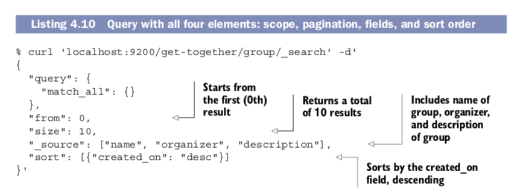
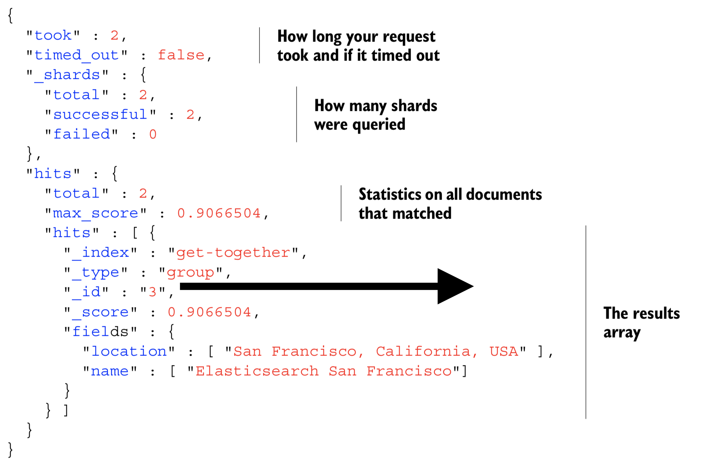
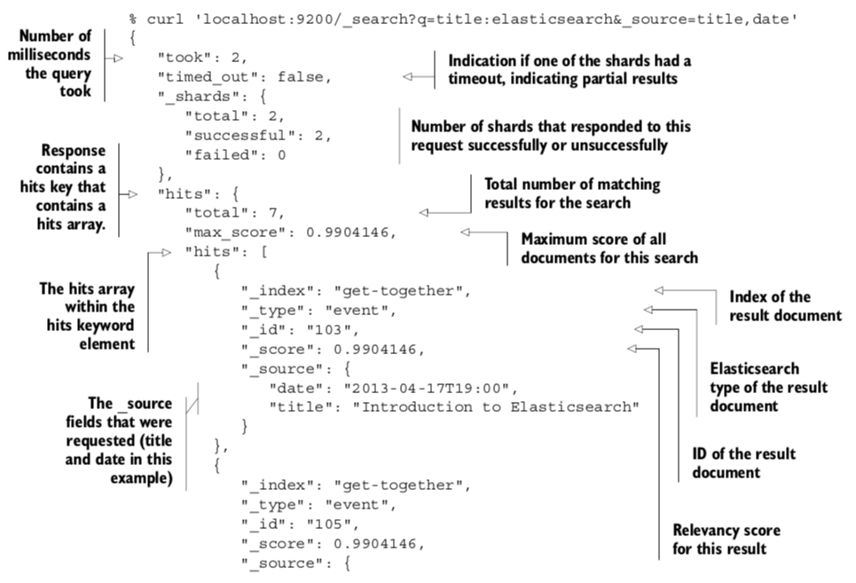

# (一) 基本概念
1. index：相当于关系型数据库的database
2. mapping type: 相当于关系型数据库的table
3. document:相当于关系型数据库的一条record
4. _id唯一标识某个docuemnt，注：该_id只在某index里唯一
5. 如果字段不在json document的root目录下，则要加上路径Path，如：campus.campus_id、xjy_campus.reached_rate
6. mapping包含了type下所有document的所有字段，但单个document中不一定包含所有字段，新增field会自动添加至mapping
7. 一个shard是一个Lucene索引：包含多个文件的目录，该目录有一个inverted index
8. 一个ElasticSearch index分成了多个shards，每个shard是一个Lucene索引;即一个ElasticSearch index是有多个Lucene index组成的；
## string类型
- text类型
text类型的字段（比如邮件内容或产品描述），此类型字段会被传递给analyzer解析器解析，把string转换成多个terms的列表，
然后编排索引。text字段不能用于sorting,也很少用来聚合。

- keyword类型 
(1) keyword类型的字段没有被analyzer解析，可用来作条件过滤、排序或聚合;
(2) 使用keyword时，match模糊查询也无法匹配

# (二) Document操作
## 1. 查询document
### 1. 多条件查询

* _source: 指定返回的field (sql中的select)
* query:表示query语句 (sql中的where)
* from/size:从第from页开始，返回size条记录,默认from=1， size=10(sql中的limit)
* sort: 排序（sql中的order by）
```cassandraql
// 表示查询所有合同名称中包含"小学"的document,并返回第0页的2条doc，按照contract_id倒序排序，
// 每个doc只显示contract_name和trainer_id两个字段
GET lqlspace/contract/_search 
{
  "_source": ["contract_name", "trainer_id"],
  "query": {
    "match": {
      "contract_name": "小学"
    }},
  "from": 0,
  "size": 2,
  "sort": {
    "contract_id": "desc" 
  }
}
```

### 2. reponse解析
搜索结果中通常包含四类：
- 查询时间(毫秒,timeout可在查询语句中指定，若超时，得到的数据仅仅是超时时聚合的数据)
- 分片数(搜索涉及到的分片)
- 命中率统计(TF-IDF算法)
- document信息（size选项可决定显示的个数）




### 3. 确定搜索范围
> 在多个index或多个type中搜索，逗号分隔
```cassandraql
GET /index1,index2/type1,type2/_search
```
> 在index下的所有type中搜索，可省略type
```cassandraql
GET /index/_search
```
> 在所有index下搜索，可省略index，或使用_all占位符
```cassandraql
GET /_search

GET /_all/_search
```

### 4. 根据_Id查询
> 直接使用URL查询，ex:campus_id为_id时，搜索学校信息如下
```cassandraql
GET /school/school/10012
```

### 5. 简单查询
#### (1) term查询：精确查询
> 跳过分析器（将关键字改为小写，并分词）
> term是text中的一个word，是搜索的最小unit，所以不可再分
```cassandraql
GET school/_search
{
"query":{
        "term":{
            "campus.campus_id":10008
        }
    }
}
```

#### （2）terms查询：多值精确查询
```cassandraql
GET lqlspace/contract/_search 
{
  "query": {
    "terms": {
      "contract_id": [10004, 10005, 10001]
    }
  }
}
```

#### (3) match查询：模糊查询
> 单个word模糊查询
```cassandraql
// 搜索contract_name中包含"内容"的document
GET lqlspace/contract/_search 
{
  "query": {
      "match": {"contract_name": "内容"}
  }
}
```
> 多值模糊查询（or查询）
```cassandraql
// 搜索contract_name中包含"内容"或"班级"的document
GET lqlspace/contract/_search 
{
  "query": {
      "match": {"contract_name": "内容 班级"}
  }
}
```
> 多值模糊查询（and查询）
```cassandraql
//表示contract_name必须包含"小学"和"武宁"两个term
GET lqlspace/contract/_search
{
  "query": {
    "match": {
      "contract_name": {
        "query": "小学 武宁",
        "operator": "and"
      }
    }
  }
}
```

#### (4) multi_math查询：（多字段模糊查询）
```cassandraql
// trainer_id和supervisor_id中查询某id
GET lqlspace/contract/_search 
{
  "query": {
    "multi_match": {
      "query": 32,
      "fields": ["trainer_id", "supervisor_id"]
    }
  }
}

//contract_name或location字段中包含沛县或班级考核单词
GET lqlspace/contract/_search
{
  "query": {
    "multi_match": {
      "query": "沛县 学习",
      "fields": ["contract_name", "location"]
    }
  }
}
```

#### (5) match_phrase查询：（短语查询）
```cassandraql
GET lqlspace/contract/_search 
{
  "query": {
    "match_phrase": {
      "contract_name": "武宁路小学 学习"
    }
  }
}
```

#### (6) match_all查询：查询某type下所有doc
```cassandraql
GET lqlspace/contract/_search 
{
  "query": {
    "match_all": {}
  },
  "sort": {
    "contract_id": "asc"
  }
}
```

#### (7) range查询：（值范围查询）
> numeric、date、string类型均可范围查询
```cassandraql
GET lqlspace/contract/_search 
{
  "query": {
    "range": {
      "contract_id": {
        "gte": 10002,
        "lte": 10003
      }
    }
  }
}
```

### 6. 复合查询
#### (1) bool查询：
组合上面的简单查询实现更复杂的逻辑
##### (a) query上下文
> 会执行排序算法，性能会受影响 

- must事件：包含多个query语句，每条都必须满足
```cassandraql
// 只有单个query语句时，must可写成大括号形式，表示包含一个对象
GET lqlspace/contract/_search
{
  "query": {
    "bool": {
      "must": { 
        "match": {
         "contract_name": "班级" 
        }
      }
    }
  }
}


// 多个query时，must为数组形式组织，表示包含多个query对象，各对象间是AND查询
GET lqlspace/contract/_search
{
  "query": {
    "bool": {
      "must": [
        {
          "match": {
              "contract_name": "班级" 
          }
        },
        {
          "match": {
            "contract_name": "沛县"
          }
        }
      ]
    }
  }
}
```
- should事件：
> (1) 若must事件、filter事件存在时，默认至少满足should语句中的0条；
```cassandraql
// 表示合同名必须包含"班级"，而"内容"则可包含可不包含
GET lqlspace/contract/_search
{
  "query": {
    "bool": {
      "must": {
        "match": {
          "contract_name": "班级" 
        }
      },
      "should": {
        "match": {
          "contract_name": "内容" 
        }
      }
    }
  }
}
```
> (2) must事件\filter事件不存在时，默认至少满足should中的1个条件（即：或查询）;
```cassandraql
// 至少满足其中1个match查询
GET lqlspace/contract/_search 
{
  "query": {
    "bool": {
      "should": [
          {"match":{"contract_name": "班级"}},
          {"match":{"location": "沛县"}}
        ]
    }
  }
}
```
> (3) minimum_should_number可更改默认设置
```cassandraql
// 表示document的contract_name必须包含"内容"，并且should中的两个条件必须满足至少1条
GET lqlspace/contract/_search
{
  "query": {
    "bool": {
      "minimum_should_match": 1, 
      "must": {
        "match": {
          "contract_name": "内容" 
        }
      },
      "should": [
          {"match":{"contract_name": "班级"}},
          {"match":{"location": "沛县"}}
        ]
      }
  }
}
```

##### (b) filter上下文
> 不执行排序算法，且会将搜索数据做cache缓存，性能更好

- must_not事件: 所有包含的query都不能满足
```cassandraql
GET lqlspace/contract/_search 
{
  "query": {
    "bool": {
      "must_not": [
          {"match":{"contract_name": "内容"}},
          {"match":{"location": "沛县"}}
        ]
      }
  }
}
```

- filter事件：
> 同must，但不会执行sort算法，且会cache，性能更好
```cassandraql
// 两个条件均需要满足
GET lqlspace/contract/_search
{
  "query": {
    "bool": {
      "filter": [
          {"match":{"contract_name": "未来"}},
          {"term":{"location.keyword": "沛县"}}
        ]
    }
  }
}
```

## 2. 创建document（PUT或POST）
> 自动创建index和type
> 特定字段作为_id值,此处为campus_id
```cassandraql
PUT lqlspace/contract/10001
{
  "contract_id": 10001,
  "contract_name": "武宁路小学+学习"
}

POST lqlspace/contract/10002
{
  "contract_name": "培训"
}
```

## 3. 更新document
> 1. 新增字段或在覆盖原有字段的值
```cassandraql
// 必须用POST,field已存在则更新值，若不存在则新增field
POST lqlspace/contract/10006/_update
{
  "doc": {
    "province": "JiangSu",
    "city": "xuzhou"
  }
}
```

> 2. 依赖原有字段值生成新值
```cassandraql
// 在city原值的基础上append"徐州"
POST lqlspace/contract/10006/_update
{
  "script": {
    "source": "ctx._source.city += params.tag",
    "lang": "painless", 
    "params": {
      "tag": "徐州"
    }
  }
}
```

## 4. 删除document
```cassandraql
DELETE lqlspace/contract/10001
```

# (三) mapping type操作
## 1. 查看mapping type
```cassandraql
GET school/school/_mapping
```

## 2. 创建mapping
```cassandraql
PUT /lqlspace/school/_mapping
{
  "properties": {
    "tt": {
      "type": "keyword"
    }
  }
}
```

## 3. mapping type不可删除
无法删除mapping中的field，也无法删除mapping type，但可通过删除index删除type
```cassandraql
DELETE lqlspace
```

## 4. type中field分析器类型
mapping定义field中的类型有三种
```cassandraql
analyzed：即会使用analyzer将text全部变成小写，并分成多个单词，组成多个terms

not_analyzed：即跳过analyzer，整个string为一个term

no：无法搜索该字段；
```

# (四) index操作
## 1. 删除index
```cassandraql
DELETE lqlspace
```
