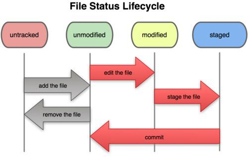

## 1. 账号配置：
```
// 配置全局账号
git config --global user.name "username"
git config --global user.email "username@xiaoheiban.com"

// 单独配置某项目（须进入项目目录下）
git config --local user.name "username"
git config --local user.email "username@xiaoheiban.com"

// 删除某项配置
git config --unset 
```

### git cherry-pick
```cassandraql
git cherry-pick b45b271b32^..e674a524a8  // 闭区间，前面的先提交的
```

### 合并分支
将develop合并到master：

```
// merge
// rebase 
grbm (git rebase master 基于master做rebase)
// 解决完冲突后 ga . ,不要做commit 
grbc (git rebase --continue)
// 如果不需要当前的log
grbs （git rebase --skip）
// 如果需要终止当前rebase
grba （git rebase --abort）
```

### 标记
- a. 打标记：git tag v0.1.0
- b. 查看标记：git tag -l
- c. 删除标记：git tag -d v0.1.0
- d. 删除远程tag：git push origin :refs/tags/v0.9.3
- e. 推送tag：git push --tags

### 恢复工作区误删除的文件
```
git ls-files -d | xargs git checkout --
```


### 删除分支
- 删除本地分支：git branch -d(-D) feature_test
- 删除远程分支：git push origin :feature_test
- 清除远程在本地存在，而远程已经删除的分支：git remote prune origin

### 恢复文件
- git checkout -- file
- 命令中的“--”很重要，没有“--”，就变成了“创建一个新分支”的命令

### hunk提交
> 自己筛选该提交哪些代码块  
```cassandraql
git add --path(或者-p)  (zsh: gapa)

//交互帮助：
y - stage this hunk
n - do not stage this hunk
q - quit; do not stage this hunk or any of the remaining ones
a - stage this hunk and all later hunks in the file
d - do not stage this hunk or any of the later hunks in the file
g - select a hunk to go to
/ - search for a hunk matching the given regex
J - leave this hunk undecided, see next hunk
e - manually edit the current hunk
? - print help
```

### 查看提交log
- 查看单行提交记录 
```cassandraql
glog : git log --oneline --decorate --graph
```

- 查看某个文件的更改
```cassandraql
//切换到某文件所在目录，然后执行：
glg|glog filename

// 同时查看修改：
glgp filename 

// 只看某次提交的某个文件变化：
git show c5e69804bbd9725b5dece57f8cbece4a96b9f80b filename
```

### git stash命令
```
git stash
git stash pop
git stash list
git stash clear
git stash apply
git stash apply stash@{1}
```

### 提交远程分支
- 首次提交分支，需要加-u与远程分支关联： git push -u origin develop /(gpsup)
- 关联过只用：git push /(gp)


### 拉分支
- 更新当前分支：git pull
- 在master上分支上更新devlop分支：git pull origin develop:develop
- 删除远程已被删除的分支： git remote prune origin

### 查看远程地址

```
git remote -v
git remote show origin
// 修改远程关联分支
git remote set-url origin newurl
```


### 清除修改
- 清除本地未提交的修改：（grhh）git reset --hard
- 清除本地已提交但是未推送的修改：git reset --hard origin/master


### git的生命周期



### git的数据流走向


### GIT练习
[GIT 练习](https://learngitbranching.js.org/?locale=zh_CN)
