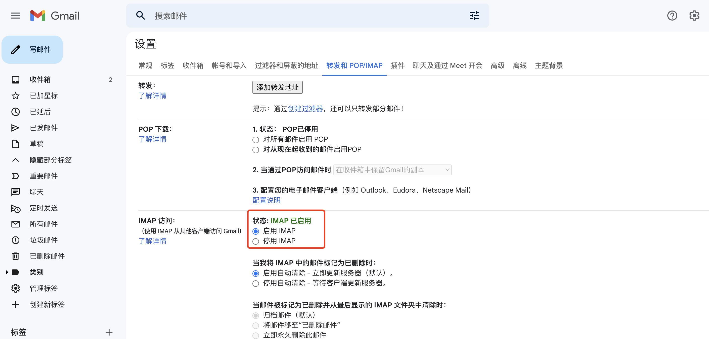
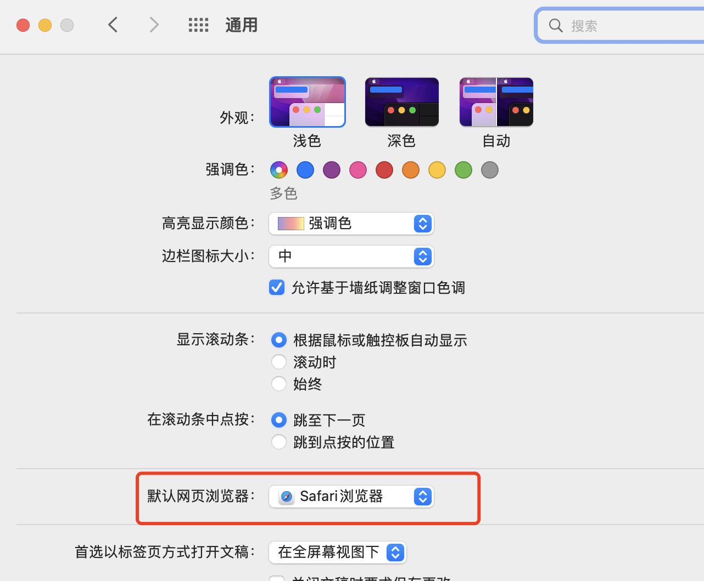
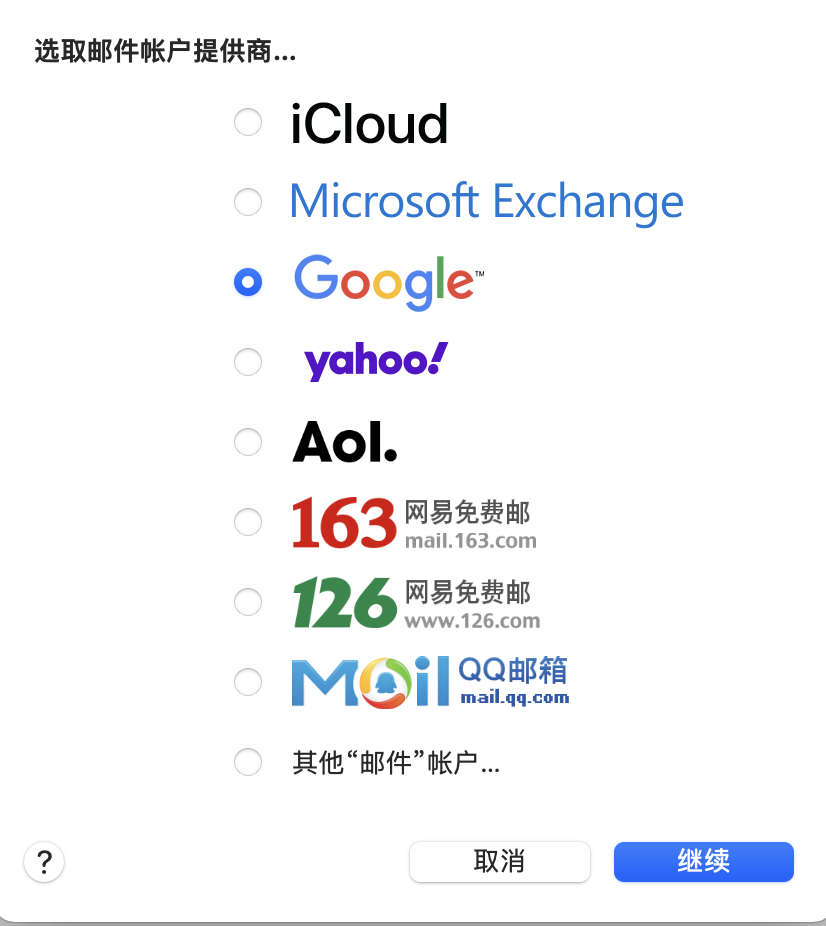
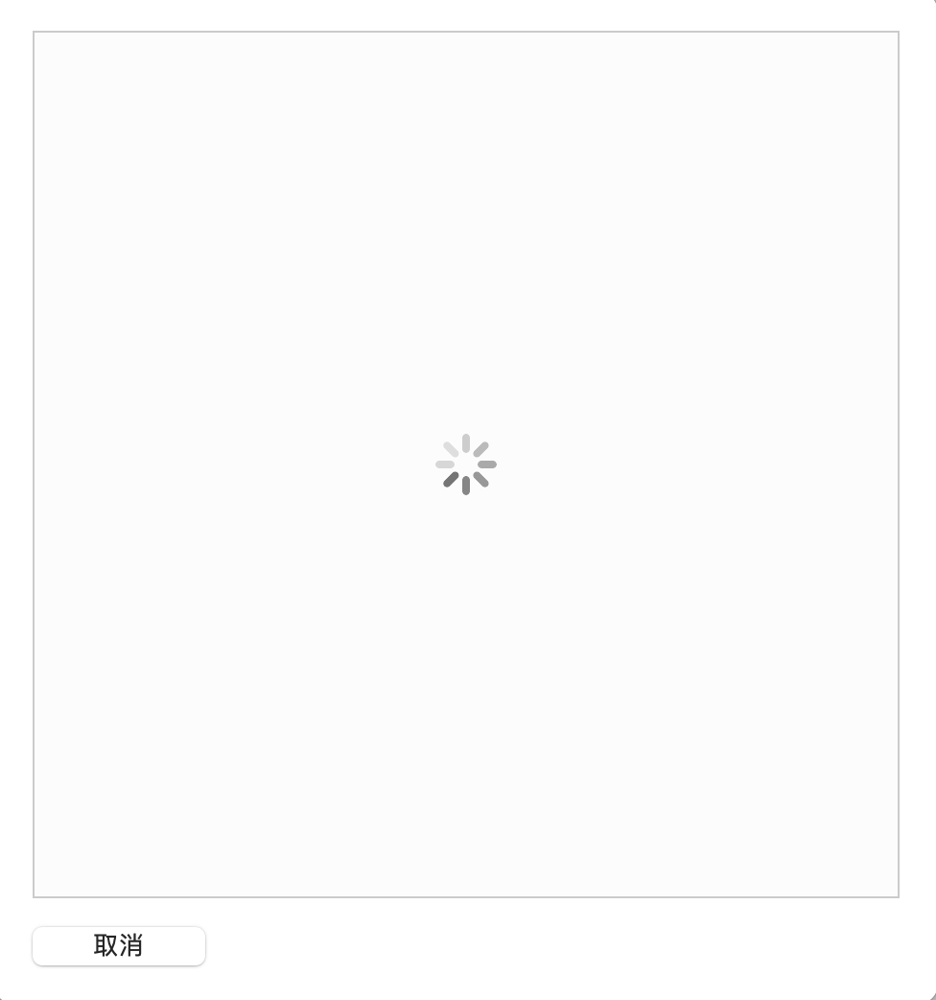
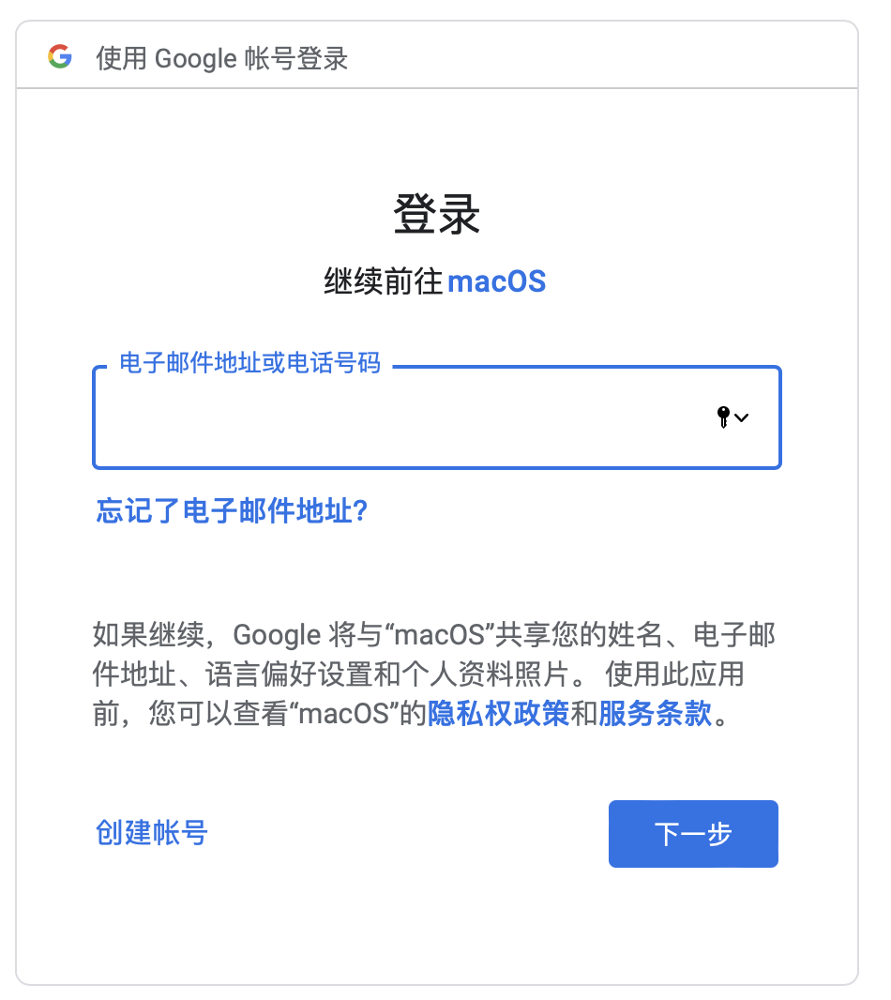

### 1.设置gamil启用IMAP

浏览器登录gmail账号->设置->转发和POP/IMAP->启用IMAP

### 2. 将默认浏览器设为Safari

系统偏好设置->通用->默认网页浏览器

### 3. 添加google账户

此时，如果未将默认浏览器设置成Safari，会一直空转：

如果默认网页浏览器设置成了Safari，则出现如下页面：

正常执行，可顺利添加gmail邮箱。
