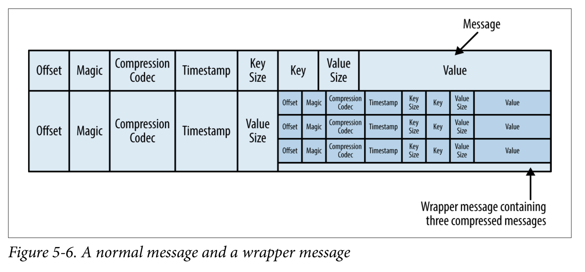
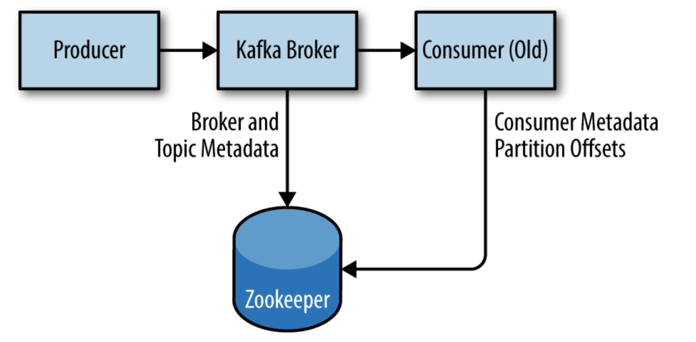

## message
kafka中的一个数据unit，被称为一个message;相当于db中的row或者record;  
消息可以有一个可选的元数据位，称为键（key）。当消息以更可控的方式写入分区（partitions）时，使用键。  
最简单的方案是生成key的一致哈希（consitent hash），然后通过获取哈希模(hash modulo)的结果（topic中的partition总数）来选择该消息的分区号。  
这样可以确保具有相同key的消息始终写入同一个分区.  
批处理只是消息的集合，所有这些消息都是为同一主题和分区生成的  
Kafka中的message按主题分类，主题还会被分解为多个partition. message以append-only的方式写到某个partition,  
并按照时间先后顺序读。但是，一个topic往往包含多个partition，不同的partition并没有时间先后顺序的关联；  
每个partition可以托管在不同的服务器上，这意味着单个topic可以跨多个服务器水平扩展，以提供远远超出单个服务器能力的性能。  

一个partition只能被一个consumer消费，但一个consumer可以消费多个partition;每个partition都有一个offset，
consumer靠offset来追踪partition消费程度，该offset会在创建时由kafka赋值；

## broker & cluster
单个kafka服务器被称作一个broker，即经纪人，代理商；broker接收来自producers的message，
分配offset，然后将消息存储至磁盘;它还服务于consumers，响应分区的获取请求，并使用提交到磁盘的消息进行响应。
根据特定的硬件及其性能特征，单个代理可以轻松地处理数千个分区和每秒数百万条消息。

broker被设计成cluster的一部分。在代理clusters中，一个broker代理还将充当集群控制器（cluster controller从集群的活动成员中自动选择）。
controller负责管理操作，包括将partition分配给broker和监视broker失败。一个分区由集群中的一个代理拥有，该代理被称为分区的leader。
一个分区可以分配给多个代理，这将导致该分区被复制。这提供了分区中消息的冗余(redundancy)，这样，如果代理出现故障，另一个代理可以接管领导权。
但是，在该分区上操作的所有消费者和生产者都必须连接到leader。

## controller
cluster membership中，brokers会争当controller，第一个启动并成功在zookeeper中注册/controller临时节点
的broker将成为controller，其他broker会创建基于该controller的zookeeper watch，一个新的controller创建
后，会使用新的controller epoch number，其他broker接收到老的number时将忽略；  
controller节点失效时，其他节点会通过zookeeper watch得到通知，会重新争当controller；  

controller会通过检查zookeeper中相关路径判断是否有broker离开cluster，所有leader节点在该broker上的partition
都需要一个新的leader。controller遍历所有需要新的leader的partition，确定新的leader应该是partition（只是该分区的副本列表中的下一个副本），
并向包含这些partition的新leader或现有follower的所有代理发送一个请求。请求包含partition的新leader和follower的信息。每一个新的leader
都知道它需要开始服务于来自客户的producer和consumer的request，而follower知道他们需要开始复制来自新leader的信息。  

当有broker加入cluster时，controller使用broker ID来检查这个broker上是否存在副本(replicas)。如果存在，controller会通知新的和现有的broker
更改，并且新broker上的副本开始复制来自现有leader的消息。  

总之，Kafka使用Zookeeper的ephemeral node特性来选择controller，并在节点加入和离开集群时通知controller。controller发现节点加入和离开集群时，
会在partition和replicas中选择leader。控制器使用历元数(epoch number)来防止出现“分裂大脑”的情况，即两个节点都认为每个节点都是当前controller。

## replica(副本)
复制(replication)非常重要，当单个节点发生故障时，复制是Kafka保证可用性(availability)和持久性(durability)的方法。  

Kafka通过topics组织数据，每个topic被分为多个partition，可存储在多个broker中，每个partition可以有多个replicas。这些replicas
分别存储在不同brokers上，每个broker上存储来自不同topic partition的成百上千个副本；  

replica有两种类型：  
- leader replica
每个partition会有一个replica被指派为leader,该leader负责接收来自producer和consumer的request，
这样可以确保一致性(consistency)。
- follower replica
除了leader以外的其他replicas被称为followers。followers并不处理来自client的服务，仅仅同步复制leader
的messages；这样，一旦leader出故障，其他某个follower可替代成为新的follower，以确保高可用性；

## request 
- produce request 
- fetch request 

### metadata request ：该消息包含client端想要的消息的topic列表;
produce request和fetch request都是发送到partition的leader replica，如果client不知道
leader replica位于哪个broker，client会先发送一个metadata request报文给broker，每个broker
都有一个metadata cache存储所有topic信息（每个topic有哪些partition,每个partition的副本，哪个副本是leader）；
client会将获取到的metadata也存放到本地cache；

### produce request：producer发送的请求报文
该报文中包含一个acks元数据，broker接到该类型报文并保存后，会根据acks的值（0,1,all）决定如何返回response；  

### fetch request：consumer发送的获取报文
该报文一般包含一个offset（表示从何从开始去报文），一个limit表示最大获取多少报文，如果不设置最大值，获取的message
太多，会占满client的内存；此外，还有一个最小报文量，如果broker中数据太少，可积累到lower boundary后再发送，
如果等待时间timeout仍未达到lower boundary的话，也要发送给client端；

leader replica里不是所有的message均可以发送给client，只取同步到所有副本的message发送；

## physical storage
kafka中最基本的存储单元是partition replica。单个分区只能存储在单个broker上，甚至只能存储在单个broker的单个disk上。
kafka会定义一个目录List,并使用directories来存储数据（partitions）;

### 1. 数据分配（数据如何被分配到cluster中的某个broker的某个directory中）
- 原则1：将某个topic的所有replicas均匀的分布在所有brokers（leader均匀分布，follower亦均匀分布）;
- 原则2：确定好需要存在哪个broker中后，kafka会计算broker中每个directory的replica数，将partition replica存储
至最少的directory中（亦保持均衡原则）；

### 2. 文件管理
Retention是kafka一个重要概念；kafka不会永远保留数据。kafka管理员会为每个topic配置一个retention period，
设置message的最长保留时间，和最大保留大小；超过即删除。  

由于在某个大的file中查找并删除某message耗时又易出错，所以每个Partition会被分成多个segments存储，每个segment
代表一个file，方便删除。此时当message写入partition时，如果达到了每个segment的阈值，则关闭该file，开启一个新的file继续存储。

我们当前正在写入的segment称作active segment。segemnt被打开时不能被删除。

#### 文件格式(file format)
每个segment分别存储在单个file中，file内容包含message和offset等。每个message除了包含key，value,offset之外，还包含
消息大小、校验码、版本号、压缩码、时间戳。  

如果producer发送的是压缩消息，由producer端压缩，consumer端解压，broker视为一个message。 

磁盘上存储的文件格式和producer端发送以及发送给
consumer端的message格式一样。方便zero-copy以及将decompressing、recompressing操作留给client端。

#### 索引(index)
为了帮助broker快速定位某个offset的message，kafka为每个partition维护一个index。index会把offset映射
到对应的segment files已经文件内部的positions。

### 3. 文件压缩

## 可靠性保证（reliability guarantees）
kafka中，只有Message被写入全部的in-sync replicas时，才被认为是committed;

## committed message versus committed offset
committed messages：是写入所有同步副本的消息，可供consumer使用。
committed offsets：consumer发送到Kafka的offset，以确认它接收并处理了partition中的所有message，直到这个特定offset为止。

## zookeeper
Apache Kafka使用Zookeeper存储关于Kafka集群的metadata，以及consumer的详细信息:

## stream
