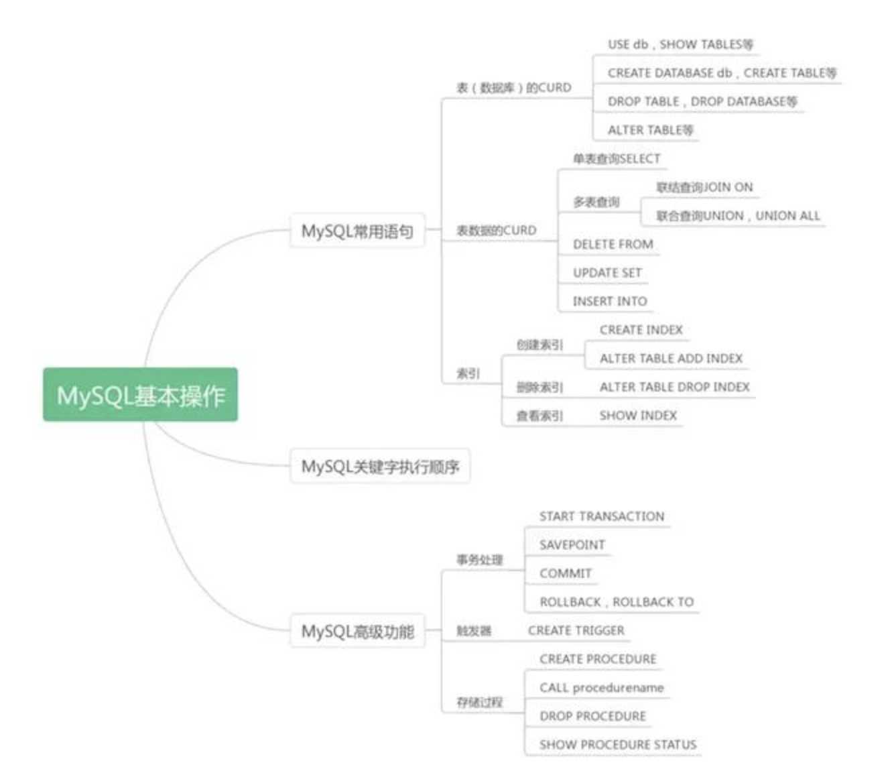
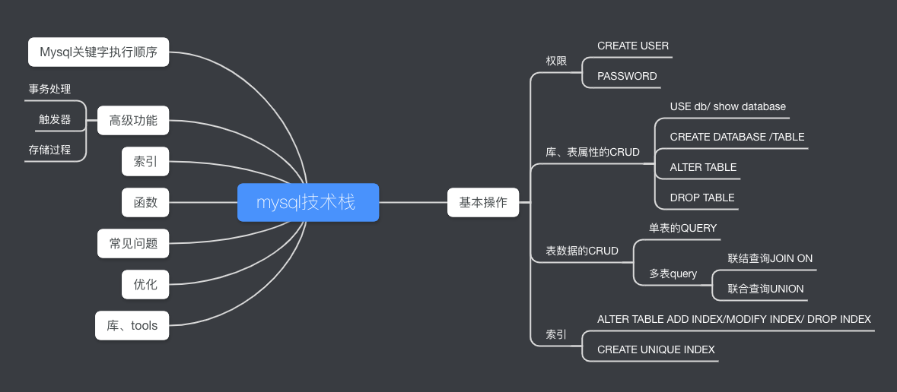

# 1. 命令行连接
```cassandraql
mysql -uroot -h127.0.0.1 -pliuql123

mysql -uallen -h127.0.0.1 -pallen123
```
- -u：用户名
- -h：主机名
- -p：密码
- -P：端口号

# 2. 查看数据库版本
```cassandraql
select version();
```

# 3. 查看sql语句占用的memory等资源情况
```cassandraql
show PROCESSLIST;
```

# 4. 权限管理（账户、密码、授权）
### 1. 创建新账户
```cassandraql
// 为ip: 127.0.0.1主机创建账户Alice，密码为"123"
create user 'alice'@'127.0.0.1' identified by '123';

// 为ip: 127.0.0.*的主机创建账户Alice，密码为"123"
create user 'alice'@'127.0.0.%' identified by '123';

// 为ip: 127.0.0.1主机创建账户Alice，密码为"123"
create user 'alice'@'%' identified by '123';
```

### 2. 删除新账户
```cassandraql
DROP USER 'alice'@'127.0.0.1'
```

### 3. 修改用户名
> 注：127.0.0.1和localhost此处不同
```cassandraql
RENAME USER 'alice'@'127.0.0.1' TO 'alex'@'127.0.0.1'
```

### 4. 修改密码
> mysql8.0之前版本
```cassandraql
SET PASSWORD FOR 'alice'@'127.0.0.1'=PASSWORD('122'); 
```
> mysql8.0版本
```cassandraql
alter user 'allen'@'127.0.0.1' identified with mysql_native_password by '123';
```

## 2. 创建table
```cassandraql
CREATE TABLE payment (
  id int(10) unsigned NOT NULL AUTO_INCREMENT,
  contract_id int(10) unsigned NOT NULL DEFAULT '0' COMMENT '合同ID',
  campus_id int(10) unsigned NOT NULL DEFAULT '0' COMMENT '学校ID',
  product varchar(50) NOT NULL DEFAULT '' COMMENT '产品',
  product_id varchar(50) NOT NULL DEFAULT '' COMMENT '产品ID',
  amount int(10) NOT NULL DEFAULT '0' COMMENT '回款金额的100倍',
  date int(10) unsigned NOT NULL DEFAULT '0' COMMENT '回款日期',
  content varchar(100) NOT NULL DEFAULT '' COMMENT '回款记录',
  creator_id int(10) unsigned NOT NULL DEFAULT '0' COMMENT '创建人ID',
  create_time timestamp NOT NULL DEFAULT CURRENT_TIMESTAMP COMMENT '创建时间',
  update_time timestamp NOT NULL DEFAULT CURRENT_TIMESTAMP ON UPDATE CURRENT_TIMESTAMP COMMENT '更新时间',
  PRIMARY KEY (`id`),
  KEY `contract_id_idx` (`contract_id`) USING BTREE
) ENGINE=InnoDB  DEFAULT CHARSET=utf8mb4 COLLATE=utf8mb4_general_ci COMMENT='回款记录表';
```

# 3. 更新表(table)
## 1. 表名重命名
> 将表test名称改为new_test
```cassandraql
ALTER  TABLE test 
RENAME TO new_test
```

## 2. 更改表的编码、collate和comment
```cassandraql
ALTER TABLE test 
CHARACTER SET utf8mb4 COLLATE utf8mb4_general_ci COMMENT 'test1'
```

## 3. 更改表编码(table character)
```cassandraql
ALTER TABLE test 
CHARACTER SET utf8mb4;
``` 
## 4. 修改collation
```cassandraql
ALTER TABLE test 
COLLATE  utf8mb4_general_ci 
```

## 5. 修改表COMMENT 
> 修改表注释为""表test"
```cassandraql
ALTER TABLE test 
COMMENT '表test'
```

## 6. 查看支持的搜索引擎（两个一起查，即可查看支持的引擎，又可看到默认引擎）
```cassandraql
show engines;   -- 查看该数据库下支持的存储引擎
show variables like '%storage_engine%'; -- 查看当前默认的存储引擎
```

## 7. 更改表的搜索引擎
```cassandraql
ALTER TABLE test 
ENGINE=InnoDB; --  修改user表的引擎为InnoDB，数据量大会修改较慢且修改时影响查询等性能
```


# 4. 更新表字段（table column）
## 2. 新增表字段
> 在age字段后面添加post字段
```cassandraql
ALTER TABLE test 
ADD COLUMN post varchar(20) NOT NULL DEFAULT '' COMMENT '部门' AFTER age;
```

## 3. 删除表字段
> 删除test表中的post字段
```cassandraql
ALTER TABLE test
DROP COLUMN post;
```

## 4. 表字段重命名
> 将intime字段重命名为in_time，属性不变
```cassandraql
ALTER TABLE test 
CHANGE COLUMN  intime in_time timestamp NULL DEFAULT NULL COMMENT '进入时间';
```

## 5. 修改表字段属性
> 1. AFTER字段调整至name字段后面；
> 2. varchar长度改为30；
> 3. COMMENT有""部门"改为"部门字段""；3. 
```cassandraql
ALTER TABLE test 
MODIFY COLUMN post varchar(30) NOT NULL DEFAULT '' COMMENT '部门字段' AFTER name;
```

## 6. 新增字段索引
> post字段添加索引
```cassandraql
ALTER TABLE test
ADD INDEX post_id(`post`) USING BTREE;
```


# 6. CRUD
## 1. 单表操作
### 1. insert
```cassandraql
// 写入单条记录
INSERT INTO test (name, age) 
VALUES ('aaa', 20);

// 批量写入(须每N条写入一次，太长会报错)
INSERT INTO test (name, age) 
VALUES ('bbb', 21),('ccc', 20),('ddd', 19);
```
### 2. update
> 1. 更新为固定值
```cassandraql
UPDATE test
SET post = '研发部'
WHERE `name` = 'aaa';
```
> 2. 同表同一条数据中，一个字段赋值给另一个字段
```cassandraql
//将post字段的值赋给name字段
UPDATE test
SET name = post 
WHERE `name` = 'aaa';
```

### 3. delete 
> 1. 删除特定记录
```cassandraql
delete from test 
where name = 'bbb';
```
> 2. 删除所有记录
```cassandraql
delete from test;
或
truncate (table) test; 
```

### 4. select 
```cassandraql
SELECT
    select_expr
FROM table_references
WHERE where_condition
GROUP BY col_name
HAVING where_condition
ORDER BY col_name [ASC | DESC]
LIMIT [offset,] row_count
```


## 2. 多表操作
### 1. 使用表A的字段赋值表B的字段
```cassandraql
update test t1  
INNER JOIN
(
		select *
		from test2 
)t2 on t1.id = t2.id 
SET t1.`name` = t2.`name`
WHERE t1.id = 1

或者：

update test, test2 
set test.`name` = test2.`name`
where test.id = 2 and test.id = test2.id;
```

### 2. 连表查询
#### 1. 左联
```cassandraql
SELECT c.id,
       c.name,
       p.id
FROM yt_contract.contract c
ALL LEFT JOIN (
    SELECT id, contract_id
    FROM yt_contract.payment
) p ON p.contract_id = c.id
ORDER BY  c.id;
```

#### 2. 右联
```cassandraql
SELECT c.id,
       c.name,
       p.id
FROM contract c
RIGHT JOIN (
    SELECT id, contract_id
    FROM payment
) p ON p.contract_id = c.id
ORDER BY  c.id;
```

#### 3. 内联
```cassandraql
SELECT c.id,
       c.name,
       p.id
FROM contract c
INNER JOIN (
    SELECT id, contract_id
    FROM payment
) p ON p.contract_id = c.id
ORDER BY  c.id;
```

# 索引
## 1. Alter命令创建索引
> 1. 创建主键
```cassandraql
ALTER TABLE tbl_name
ADD PRIMARY KEY (column_list)
```
> 2. 创建唯一索引
```cassandraql
ALTER TABLE tbl_name
ADD UNIQUE index_name (column_list)
```

> 3. 创建普通索引
```cassandraql
ALTER TABLE tbl_name
ADD INDEX index_name (column_list)
```

> 4. 创建FULLTEXT索引
```cassandraql
ALTER TABLE tbl_name
ADD FULLTEXT index_name (column_list)
```

> 5. 删除索引
```cassandraql
ALTER TABLE test
DROP INDEX idx_id;
```

> 6. index重命名
```cassandraql
ALTER TABLE test2 
RENAME INDEX id_id TO id_idx;
```
> 7. 查询某表的index列表
```cassandraql
SHOW INDEX 
FROM tbl_name;
```


