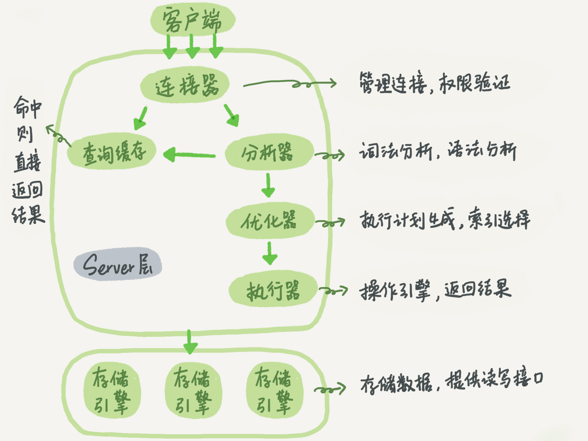
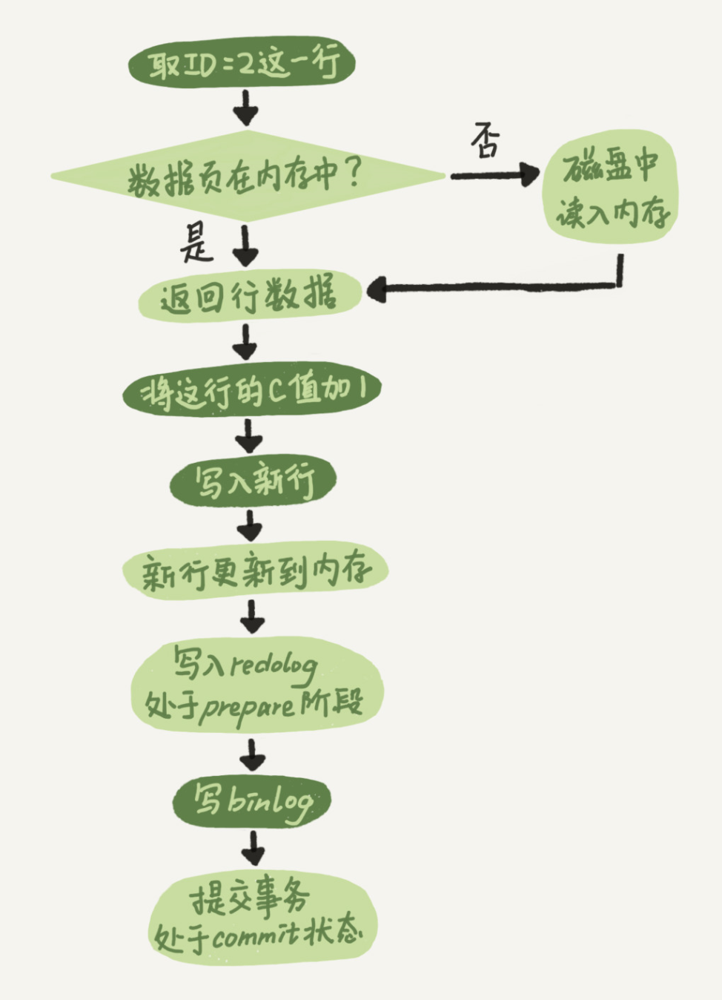
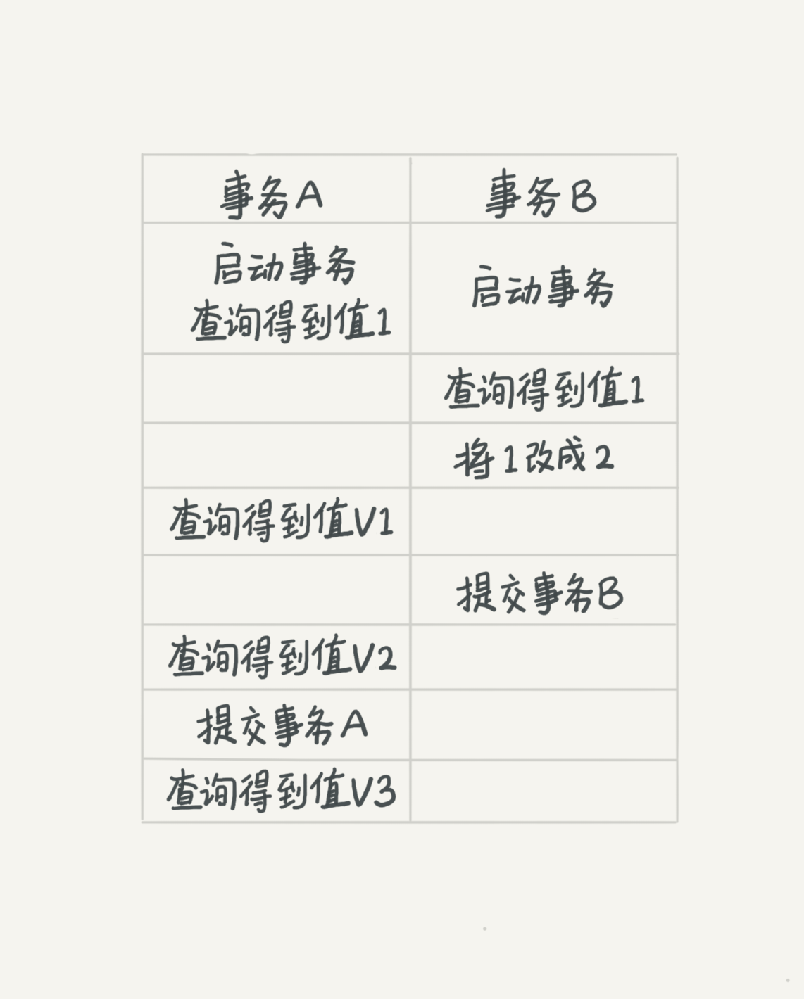
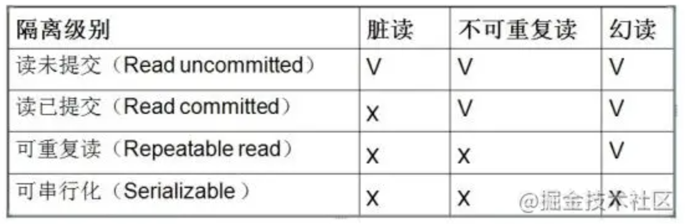
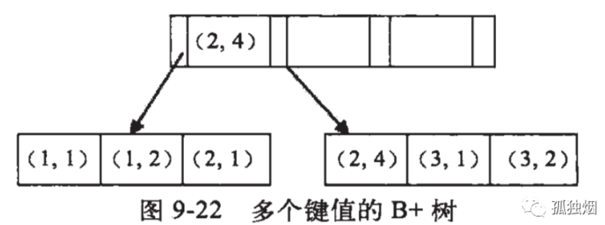

# 1. 查询&更新操作流程
## 1）一条SQL查询语句是如何执行的（select * from T where ID=10）？


* 客户端一般通过长连接将sql语句发送给服务器端，服务器将sql语句交给分析器，由分析器来做词法分析和语法分析，
如果没有语法问题，分析器查询缓存可是否命中，这个缓存使用效果不佳，8.0版本已经去掉了，缓存中没有的话
交给优化器，优化器来找出一种最快最高效的查询方式，然后调用执行器来执行，执行器则调用了底层存储引擎接口来
具体完成数据的查询，并返回结果集；
没有索引时：
* 调用 InnoDB 引擎接口取这个表的第一行，判断 ID 值是不是 10，如果不是则跳过，如果是则将这行存在结果集中；
* 调用引擎接口取“下一行”，重复相同的判断逻辑，直到取到这个表的最后一行。
* 执行器将上述遍历过程中所有满足条件的行组成的记录集作为结果集返回给客户端。

有索引时：
对于有索引的表，执行的逻辑也差不多。第一次调用的是“取满足条件的第一行”这个接口，之后循环取“满足条件的下一行”这个接口，这些接口都是引擎中已经定义好的。

## 2）一条SQL更新语句是如何执行的（update T set c=c+1 where ID=2）？  
> 使用"两阶段提交"确保两份日志数据的一致性；


* 执行器先找引擎取 ID=2 这一行。ID 是主键，引擎直接用树搜索找到这一行。如果 ID=2 这一行所在的数据页本来就在内存中，就直接返回给执行器；否则，需要先从磁盘读入内存，然后再返回。
* 执行器拿到引擎给的行数据，把这个值加上 1，比如原来是 N，现在就是 N+1，得到新的一行数据，再调用引擎接口写入这行新数据。
* 引擎将这行新数据更新到内存中，同时将这个更新操作记录到 redo log 里面，此时 redo log 处于 prepare 状态。然后告知执行器执行完成了，随时可以提交事务。
* 执行器生成这个操作的 binlog，并把 binlog 写入磁盘。
* 执行器调用引擎的提交事务接口，引擎把刚刚写入的 redo log 改成提交（commit）状态，更新完成。


## 3）redo log 和 binlog
* 1）redo log是innodb特有的，binlog是mysql server层实现的，所有引擎都可以使用；
* 2）redo log是物理日志，记录的是"在某个数据页上做了什么修改"；binlog是逻辑日志，记录的是这个语句的原始逻辑："给 ID=2 这一行的 c 字段加 1"
* 3）redo log是循环写的，空间固定会用完；binlog是追加写入的，binlog文件写到一定大小后会切换到写一个文件；

## 4）怎样让数据库恢复到半个月内任意一秒的状态？
* 首先，找到最近的一次全量备份，如果你运气好，可能就是昨天晚上的一个备份，从这个备份恢复到临时库；
* 然后，从备份的时间点开始，将备份的 binlog 依次取出来，重放到中午误删表之前的那个时刻。
* 这样你的临时库就跟误删之前的线上库一样了，然后你可以把表数据从临时库取出来，按需要恢复到线上库去。


# 2. 事务
## 1）MySQL事务的特性ACID?
* 原子性（Atomicity）：事务的所有操作要么全部执行，要么全部不执行；
* 一致性（Consistency）：事务执行完后，数据的一致性没有被破坏；
* 隔离性（Isolation）：多个事务并发执行时数据会相互隔离，有不同的隔离级别(读未提交、读提交、可重复读、串行化) ；
* 持久性（Durability）：事务对数据的修改是持久性的，宕机也不会消失；

## 2）脏读、不可重复读、幻读？

我们来看看在不同的隔离级别下，事务 A 会有哪些不同的返回结果，也就是图里面 V1、V2、V3 的返回值分别是什么。

* 若隔离级别是“读未提交”， 则 V1 的值就是 2。这时候事务 B 虽然还没有提交，但是结果已经被 A 看到了。因此，V2、V3 也都是 2。
* 若隔离级别是“读提交”，则 V1 是 1，V2 的值是 2。事务 B 的更新在提交后才能被 A 看到。所以， V3 的值也是 2。
* 若隔离级别是“可重复读”，则 V1、V2 是 1，V3 是 2。之所以 V2 还是 1，遵循的就是这个要求：事务在执行期间看到的数据前后必须是一致的。
* 若隔离级别是“串行化”，则在事务 B 执行“将 1 改成 2”的时候，会被锁住。直到事务 A 提交后，事务 B 才可以继续执行。所以从 A 的角度看， V1、V2 值是 1，V3 的值是 2。

> 脏读：指一个事务中访问到了另外一个事务未提交的数据；
> 不可重复读：前后多次读取，数据内容不一致，针对的是update操作；
> 幻读：前后多次读取，记录条数不一致，针对的是insert、delete操作；




# 3. 索引
## 1）MySQL采用什么数据结构存储数据？为什么？
在 InnoDB 中，表都是根据主键顺序以索引的形式存放的，这种存储方式的表称为索引组织表。InnoDB 使用了 B+ 树索引模型，所以数据都是存储在 B+ 树中的。
mysql采用B+树存储数据和索引，叫做索引组织表。这是由磁盘的特性决定的，磁盘是IO设备，访问磁盘的速度远远大于访问内存，
为了尽快查到数据，应尽可能减少访问磁盘的速度。B+树的特点是数据全部存储在叶子结点上，中间节点和根节点用来存储索引key，
这么设计的好处是：1. 所有数据的访问次数都很均衡，即树的高度；2. 中间节点全部用来存储索引key，使得B+树相较于B树等结构
的中间节点更少，树的高度就越低，访问次数就越少，查询效率就越高；

## 2）MySQL索引基本概念
* 根据叶子节点的内容，索引类型分为主键索引和非主键索引。
* 主键索引的叶子节点存的是整行数据。在 InnoDB 里，主键索引也被称为聚簇索引（clustered index）。
* 非主键索引的叶子节点内容是主键的值。在 InnoDB 里，非主键索引也被称为二级索引（secondary index）。
* 覆盖索引：要查询的值已经在普通索引树上了，不需要回表，可从索引树直接返回，可以提高查询效率；
* 联合索引：

## 3) 基于主键索引和普通索引的查询有什么区别？
* 如果语句是 select * from T where ID=500，即主键查询方式，则只需要搜索 ID 这棵 B+ 树；
* 如果语句是 select * from T where k=5，即普通索引查询方式，则需要先搜索 k 索引树，得到 ID 的值为 500，再到 ID 索引树搜索一次。这个过程称为回表。
* 也就是说，基于非主键索引的查询需要多扫描一棵索引树。因此，我们在应用中应该尽量使用主键查询。

## 4）谈谈你对MySQL联合索引的认识？
基于多个字段构建的索引称为联合索引，也称为复合索引；
对于复合索引:Mysql从左到右的使用索引中的字段，一个查询可以只使用索引中的一部份，但只能是最左侧部分。
例如索引是key index (a,b,c). 可以支持a | a,b| a,b,c 3种组合进行查找，但不支持 b,c进行查找 .当最左侧字段是常量引用时，索引就十分有效。
联合索引碰到范围查找时会停止匹配。

### 最左匹配原则
假设，我们对(a,b)字段建立索引，如下图：

如图所示他们是按照a来进行排序，在a相等的情况下，才按b来排序。
什么意思呢？
从全局来看，b的值为1，2，1，4，1，2，是无序的，因此直接执行b = 2这种查询条件没有办法利用索引。

从局部来看，当a的值确定的时候，b是有序的。例如a = 1时，b值为1，2是有序的状态。当a=2时候，b的值为1,4也是有序状态。
因此，你执行a = 1 and b = 2是a,b字段能用到索引的。而你执行a > 1 and b = 2时，a字段能用到索引，b字段用不到索引。因为a的值此时是一个范围，不是固定的，在这个范围内b值不是有序的，因此b字段用不上索引。

综上所示，最左匹配原则，在遇到范围查询的时候，就会停止匹配。

如何建立索引呢？
> 题型一：
```cassandraql
SELECT * FROM table WHERE a = 1 and b = 2 and c = 3; 
```
(a,b,c)或者(c,b,a)或者(b,a,c)都可以，重点要的是将区分度高的字段放在前面，区分度低的字段放后面。像性别、状态这种字段区分度就很低，我们一般放后面。

> 题型二：
```cassandraql
SELECT * FROM table WHERE a > 1 and b = 2;
```
对(b,a)建立索引。如果你建立的是(a,b)索引，那么只有a字段能用得上索引，毕竟最左匹配原则遇到范围查询就停止匹配。
如果对(b,a)建立索引那么两个字段都能用上，优化器会帮我们调整where后a,b的顺序，让我们用上索引。

> 题型三：
```cassandraql
SELECT * FROM `table` WHERE a > 1 and b = 2 and c > 3; 
```
(b,a)或者(b,c)都可以，要结合具体情况具体分析；

> 题型四：
```cassandraql
SELECT * FROM `table` WHERE a = 1 ORDER BY b;
```
对(a,b)建索引，当a = 1的时候，b相对有序，可以避免再次排序！

> 题型五：
```cassandraql
SELECT * FROM `table` WHERE a > 1 ORDER BY b; 
```
因为a的值是一个范围，这个范围内b值是无序的，没有必要对(a,b)建立索引。

> 题型六：
```cassandraql
SELECT * FROM `table` WHERE a IN (1,2,3) and b > 1; 
```
对(a，b)建立索引，因为IN在这里可以视为等值引用，不会中止索引匹配，所以还是(a,b)

